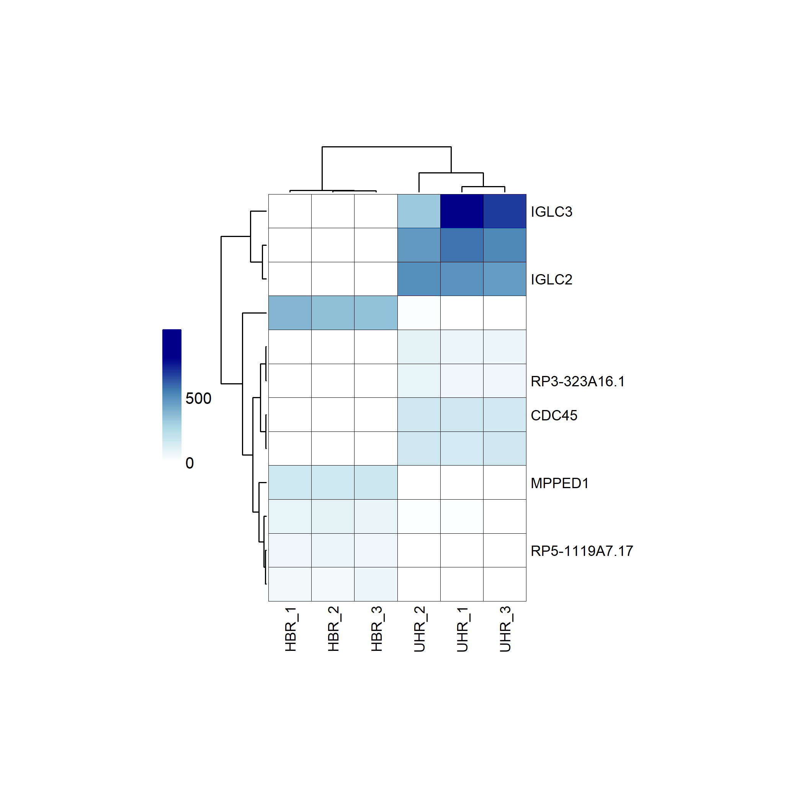
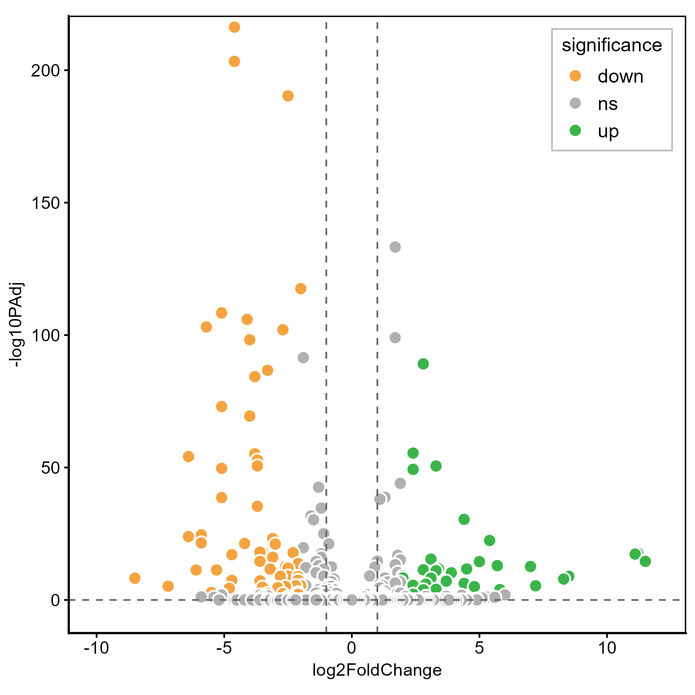
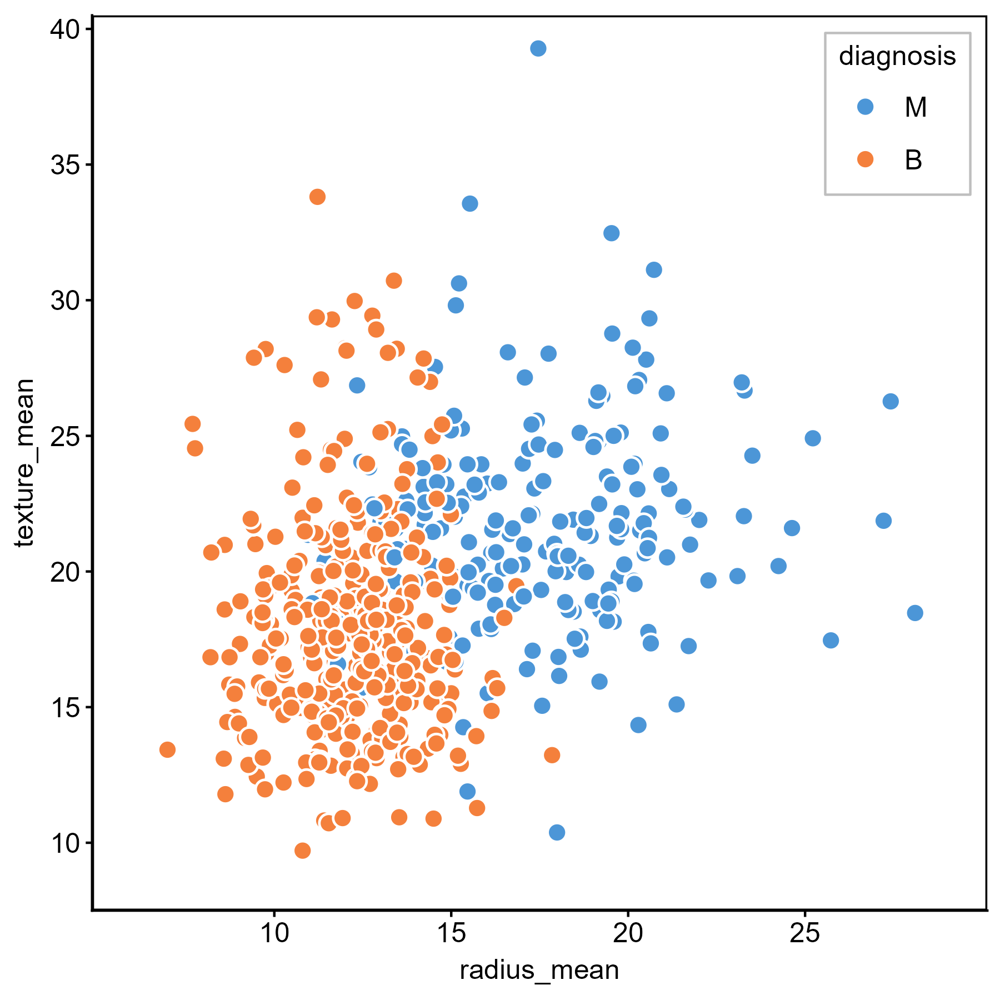
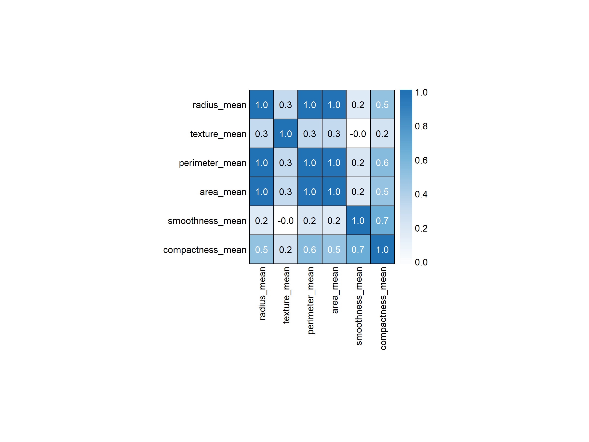
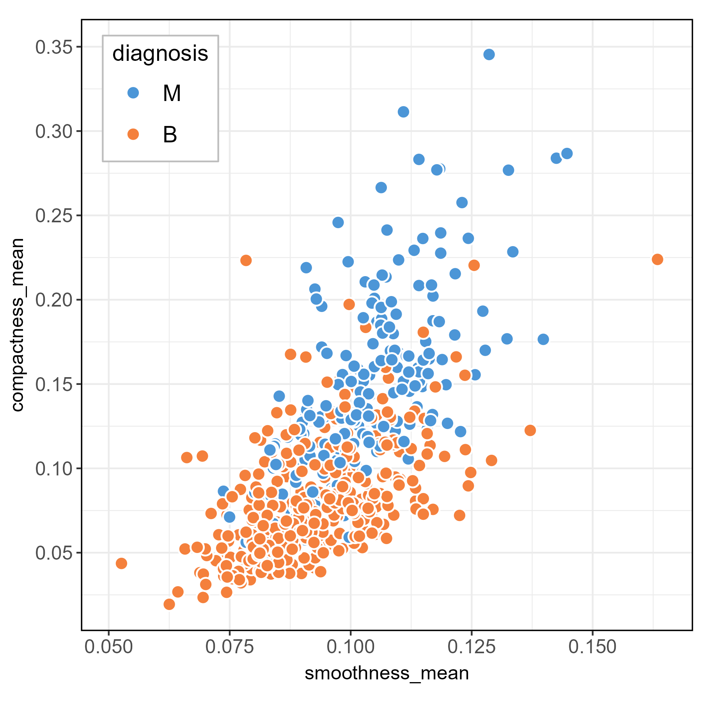
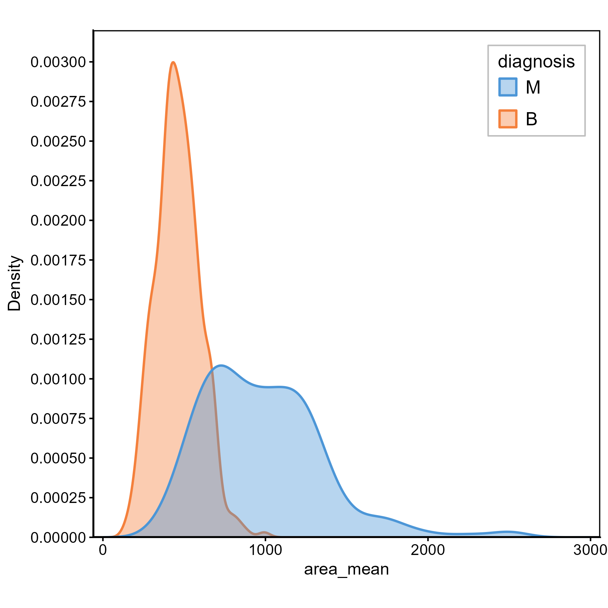

# Bioinformatics Visualization in R - Independent Dataset Analysis

**Exploratory visualization of two independent datasets: RNA-seq gene expression data (HBR vs UHR) and the Breast Cancer Wisconsin (Diagnostic) dataset.**

**Created as part of the HackBio Data Visualization in Bio (vizbio) Internship (Stage 2).**

------------------------------------------------------------------------------------------

## Repository structure

```r
Part_1_Independent_Datasets/
├── README.md
├── scripts/
│   └── HackBio_Stage_2_Datasets_Plots_CLEAN.R
└── figures/
    ├── 01_Heatmap_Gene_Expression_Analysis.png
    ├── 02_Volcano_Plot_DE_Chromosome22.png
    ├── 03_Scatter_Plot_RadiusVSTexture.png
    ├── 04_Correlation_Heatmap.png
    ├── 05_Scatter_compactness_vs_smoothness.png
    ├── 06_Density_area_mean.png
    └── Final_Figure_Assembled_Datasets.png
```

All three datasets are read directly from URLs in the HackBio project collection, so no local data files are needed.

## Datasets

**1. Normalized gene expression counts** (`hbr_uhr_top_deg_normalized_counts.csv`).
  * 12 differentially expressed genes (rows) × 6 samples (columns).
  * Two conditions: HBR (Human Brain Reference) and UHR (Universal Human Reference), 3 replicates each.
  * Column naming: `[Tissue]_[Replicate]`, e.g. `HBR_1`, `UHR_2`.
  * Values are normalized expression counts, from 0 (not expressed) to ~800 (highly expressed).

HBR is brain tissue, rich in neurons; UHR is a mixture of cancer cell lines with no neuronal component. Genes high in HBR and near zero in UHR are typically brain-specific.

**2. Differential expression results, chromosome 22** (`hbr_uhr_deg_chr22_with_significance.csv`)
  * Columns: `log2FoldChange`, `PAdj`, `-log10PAdj`, `significance`.
  * `PAdj` is the adjusted p-value (corrected for multiple testing); `-log10PAdj` is the transformed value used for the volcano plot y-axis.
  * `significance` is a categorical label with three levels: `up`, `down`, `ns`.

**3. Breast Cancer Wisconsin (Diagnostic) Dataset** (`data-3.csv`)
  * 569 patient samples, 30 features measuring cell nucleus characteristics.
  * Features derived from digitized fine needle aspirate (FNA) microscopy images: radius, texture, perimeter, area, smoothness, compactness and others.
  * Binary classification: malignant (M) vs benign (B).

## How to run

```r
install.packages(c("ggplot2", "dplyr", "scales", "patchwork", "cowplot", "magick"))
BiocManager::install("ComplexHeatmap")

library(ggplot2); library(dplyr); library(ComplexHeatmap); library(grid)

source("scripts/HackBio_Stage_2_Datasets_Plots_CLEAN.R")
```

**Note on graphics systems:** `ggplot2` plots are saved with `ggsave()`, but `ComplexHeatmap` uses the grid graphics system and requires `png()` → `draw()` → `dev.off()`. Mixing these up produces blank or empty output files. The same distinction matters at assembly time: the saved PNGs are re-imported with `ggdraw() + draw_image()` so that grid-based and ggplot-based panels can be combined by `patchwork`.

-----------------------------------------------------------------

## Plot 1 — Gene expression heatmap



### Dataset & Biology
* 12 differentially expressed genes across 6 samples (3 HBR, 3 UHR).
* Normalized expression counts quantify gene activity per sample.
* HBR vs UHR comparison reflects tissue-specific expression: brain-specific genes are high in HBR and near zero in UHR, and vice versa.

### Plot features
* Selective gene labelling (only 6 genes of interest are named on the Y axis out of 12 total genes displayed).
* Colour gradient applied to indicate normalized expression levels (Low: white, High: dark blue), built with `colorRampPalette(c("white", "lightblue", "steelblue", "darkblue"))`.
* Hierarchical clustering dendrograms displayed for both genes (left) and samples (top).
* Samples ordered HBR_1–HBR_3 then UHR_1–UHR_3 while preserving the dendrogram structure.
* Colorbar legend placed on the left, showing the normalized count scale with ticks at 0 and 500.
* Thin black cell borders separate the tiles.
* Gene labels on the right, sample labels rotated 90° at the bottom, font size 9.

### Conceptual reasoning

**Why ComplexHeatmap rather than pheatmap or ggplot2?**
* `pheatmap` is the simplest to use but gives limited control - in particular, the legend title cannot be removed independently of the legend itself, and it takes its text from the object passed in.
* `ggplot2` (`geom_tile`) is highly flexible, but has no native dendrogram support; combining a heatmap with aligned dendrograms requires `ggdendro` plus `patchwork`, and getting the alignment exact is a long fight.
* `ComplexHeatmap` has a steeper learning curve but handles dendrogram alignment natively and gives precise control over legends, annotations and colours.

**Dendrogram leaf order is flexible**
* Leaves can be rotated at each internal node without changing the validity of the clustering.
* This allowed forcing the desired sample order (HBR_1, HBR_2, HBR_3, UHR_1, UHR_2, UHR_3) while preserving the dendrogram structure, using `reorder(as.dendrogram(col_hclust), wts = match(...))`.
* Keeping replicates grouped makes the condition-level contrast readable, which an unconstrained clustering order would scatter.
* Row clustering is left fully data-driven, since the point there is to discover which genes group together.

**Why label only some genes?**
* All 12 genes are displayed as rows, but only the 6 genes of interest are named, matching the reference figure and keeping the axis legible.
* Implemented by building a label vector with `ifelse(rownames(mat) %in% labeled_genes, rownames(mat), "")` and passing it to `row_labels`.

**Extending the colour scale beyond the labelled range**
* The legend breaks are set at 0, 500 and 1000, but only 0 and 500 carry labels.
* This places 500 at the middle of the colorbar and gives the gradient more room, without cluttering the legend with an endpoint value that adds nothing.

-----------------------------------------------------------------------------------------------------------------------------------

## Plot 2 — Volcano plot: differential expression on chromosome 22



### Dataset & Biology
* Differential expression statistics for chromosome 22 genes.
* Log2 fold change quantifies the expression difference between HBR and UHR.
* Adjusted p-values (multiple testing corrected) indicate statistical significance.
* Genes are classified as upregulated, downregulated, or non-significant.

### Plot features
* log2FoldChange plotted against -log10PAdj.
* Gene points coloured by significance class: upregulated green (#3ab54a), downregulated orange (#f4a340), non-significant grey (#b0b0b0).
* Gene points outlined with a white border for improved visibility (`shape = 21`, stroke 0.8).
* Significance thresholds at log2FoldChange = ±1 indicated by dashed vertical lines.
* Horizontal dashed line at -log10PAdj = 0.
* Colour-coded legend indicating expression significance groups, positioned inside the plot at the top right with a grey border.
* Black panel border, aspect ratio fixed at 1.
* Axis range set with `coord_cartesian()`.

### Conceptual reasoning

**Why a volcano plot?**
* Combines two independent pieces of information in one view: effect size (fold change, x-axis) and statistical confidence (adjusted p-value, y-axis).
* A gene can have a large fold change but poor significance, or be highly significant with a small effect - a volcano plot shows both at once, which neither a bar chart of fold changes nor a p-value list would do.

**Why -log10 of the adjusted p-value?**
* Raw p-values cluster near zero and are unreadable on a linear axis.
* The -log10 transformation inverts and expands that range, so the most significant genes sit at the top of the plot where the eye expects them.

**Why adjusted rather than raw p-values?**
* Testing thousands of genes at once inflates false positives; the adjustment corrects for multiple testing, so the significance shown is the one that actually supports a conclusion.

**The `fill` vs `color` trap in ggplot2**
* Adding white borders to points requires `shape = 21`, which unlocks two independent colour channels: `color` controls the border, `fill` controls the interior.
* The default `shape = 16` has only `color`, so switching to 21 means changing `aes(color =)` to `aes(fill =)` and `scale_color_manual()` to `scale_fill_manual()` throughout.
* This applies to all hollow shapes in R (21–25), not just circles.

**Why `coord_cartesian()` for the axis range?**
* Setting limits through `scale_x_continuous(limits = ...)` removes data points outside the range before the plot is drawn, which silently changes what is shown.
* `coord_cartesian()` zooms the view while keeping all data in the calculation — the correct choice whenever the aim is framing rather than filtering.

--------------------------------------------------------------------------------------------------------

## Plot 3 — Scatter plot: radius vs texture



### Dataset & Biology
* Breast Cancer Wisconsin (Diagnostic) dataset: 569 tumor samples.
* `radius_mean` and `texture_mean` are morphological measurements of cell nuclei from digitized FNA images.
* Points classified by diagnosis: malignant (M) vs benign (B).

### Plot features
* Points drawn with `shape = 21`: white border (stroke 0.8), fill by diagnosis, size 3.3.
* Colour coding: M = blue (#4C96D7), B = orange (#F4803C).
* Legend order reversed so that B appears above M, positioned inside the plot at the top right with a grey border.
* `theme_classic()` — no gridlines — with a black panel border added back.
* Aspect ratio fixed at 1; axis breaks set manually every 5 units.
* Axis range set with `coord_cartesian()` so no points are dropped.

### Conceptual reasoning

**Why a scatter plot?**
* Shows the joint distribution of two continuous features and whether the diagnosis groups separate in that two-dimensional space.
* Overlap between the groups is as informative as separation: it shows that no single pair of features classifies tumors perfectly, which is why the full dataset carries 30 features.

**Why white point borders?**
* With 569 overlapping points, borders visually separate individual observations that would otherwise merge into a solid mass.
* This is what makes `shape = 21` necessary rather than the default point shape.

------------------------------------------------------------------------------------------

## Plot 4 — Correlation heatmap



### Dataset & Biology
* Pairwise correlations between six key morphological features of breast tumor cell nuclei: radius, texture, perimeter, area, smoothness and compactness.
* Correlations reveal strong inter-feature dependencies.
* Radius, perimeter and area are almost perfectly correlated (r ≈ 1.0), which makes biological sense since all three describe nucleus size; texture and smoothness are relatively independent of the size-related features.

### Plot features
* Pairwise Pearson correlation coefficients displayed as a 6×6 symmetric matrix.
* Correlation values annotated inside each tile, one decimal place, font size 9.
* Tile colour encodes correlation strength (white → #c6dbef → #6baed6 → #2171b5).
* Font colour switches to white for tiles above 0.4 for improved readability against the darker blues.
* Colorbar legend on the right, scale 0.0 to 1.0 with labelled ticks and no border.
* Black cell borders create a visible grid.
* Row names on the left, column names rotated 90°.
* No clustering applied — original feature order preserved.

### Conceptual reasoning

**Why visualize correlations at all?**
* Several of the selected features are geometrically related, so they carry overlapping information.
* A correlation heatmap makes these redundancy blocks visible at a glance, which matters before any modelling: strongly correlated features are not independent evidence.

**Why no clustering here, when the gene expression heatmap was clustered?**
* The correlation matrix is symmetric and the feature order is already meaningful, so clustering would add nothing and would break the diagonal structure that makes a correlation matrix readable.
* The gene expression heatmap clusters genes because the purpose there is to *discover* which genes group together; here the relationships are read directly off the annotated values.

**Why annotate the values inside the tiles?**
* With only 36 cells there is room for the numbers, and exact coefficients are more useful than colour alone when the point is to judge how close a pair sits to r = 1.
* The white-text threshold exists because dark tiles make black text unreadable; it is implemented inside `cell_fun` with `ifelse(cor_matrix[i, j] > 0.4, "white", "black")`.

------------------------------------------------------------------------------------------------------------

## Plot 5 — Scatter plot: smoothness vs compactness



### Dataset & Biology
* `smoothness_mean` and `compactness_mean` describe the contour regularity and shape compactness of cell nuclei.
* Points classified by diagnosis: malignant (M) vs benign (B).

### Plot features
* Points drawn with `shape = 21`, white border, fill by diagnosis (M = #4C96D7, B = #F4803C), matching the first scatter plot.
* `theme_bw()` used to retain gridlines, matching the reference figure.
* Legend order reversed, positioned inside the plot at the top left with a grey border.
* Axis breaks set manually on both axes; range set with `coord_cartesian()`.
* Aspect ratio fixed at 1; black panel border.

### Conceptual reasoning

**Why `theme_bw()` here but `theme_classic()` for the other scatter plot?**
* `theme_classic()` removes gridlines; the reference figure for this panel has them.
* Gridlines help read values off a scatter plot whose axes span narrow numeric ranges (0.05–0.16 and 0.02–0.35), where position alone is hard to translate into a number.

**Consistent encoding across panels**
* The same colour pair, point shape, border and size are used as in the radius vs texture plot, so a reader moving between the two panels does not have to relearn the visual language.
* Only the theme differs, and only because the reference figures differ.

---------------------------------------------------------------------------------------------------------------------

## Plot 6 — Density plot: nucleus area distribution



### Dataset & Biology
* Distribution of cell nucleus area (`area_mean`) across malignant and benign breast tumor samples.
* Benign tumors show a sharp narrow peak at small area values; malignant tumors show a broader distribution shifted towards larger areas, reflecting the greater size and size-variability of malignant cells.

### Plot features
* Kernel density estimates (KDE) plotted for both diagnosis groups on the same axis.
* Both `fill` and `color` mapped to diagnosis, so each curve has a matching outline and shaded area (M = #4C96D7, B = #F4803C).
* Fill transparency (alpha 0.4) keeps the overlapping region readable.
* Y-axis formatted to five decimal places with no expansion at the baseline, so the curves sit on the axis.
* X-axis limited to 0–3000 with breaks every 1000.
* Legend order reversed, positioned inside the plot at the top right with a grey border.
* Labelled axes, aspect ratio fixed at 1, black panel border.

### Conceptual reasoning

**Why a density plot rather than a histogram?**
* A histogram's appearance depends on arbitrary bin boundaries, and two overlaid histograms are hard to read.
* KDE produces smooth curves that can be overlaid on the same axis, making the comparison between diagnosis groups direct.

**Why transparency?**
* The two distributions overlap in the mid-range; without alpha, whichever group is drawn second would hide the other exactly where the comparison matters most.

**R and Python KDE plots differ for a reason**
* Reproducing this plot from Python gave a different Y-axis peak (~0.003 in R vs ~0.00175 in Python) from identical data.
* R uses Silverman's rule for bandwidth selection by default; Python's seaborn uses Scott's rule.
* A wider bandwidth produces a flatter curve with a lower peak, which is what R's default gives here.
* These are two different mathematical approaches to smoothing, producing visually different plots and biologically identical conclusions — the distribution and the comparison between groups are unchanged.

---------------------------------------------------------------------------------------------------------------------------------------

## Final assembly

The six saved PNG panels are re-imported with `cowplot::draw_image()` and arranged by `patchwork` into a two-row grid (a, b, c on top; d, e, f below), tagged a–f, and exported at 24 × 13 inches at 300 dpi.

Re-importing saved images rather than combining live plot objects is what allows the grid-based `ComplexHeatmap` panels and the `ggplot2` panels to sit in the same figure, and it also guarantees that each panel appears exactly as it was individually tuned.

---------------------------------------------------------------------------------------------------------------------------------------------------

## Tools

| Package | Use |
|---------|-----|
| `ggplot2` | Volcano plot, both scatter plots, density plot |
| `ComplexHeatmap` | Gene expression heatmap, correlation heatmap |
| `grid` | `unit()`, `gpar()` and `grid.text()` for in-tile annotation in the correlation heatmap |
| `dplyr` | Feature selection |
| `scales` | Y-axis number formatting in the density plot |
| `patchwork`, `cowplot`, `magick` | Final multi-panel assembly |

----------------------------------------------------------------------------------------------------------------------------------------------------------------

*All visualizations were created as part of the HackBio Data Visualization in Bio (vizbio) Internship.*


