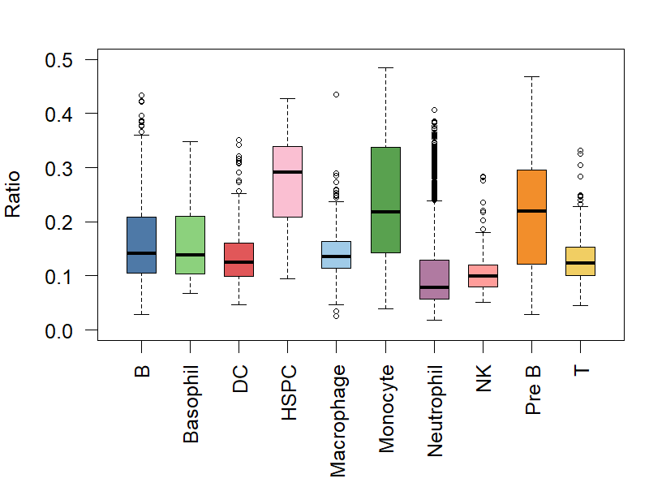
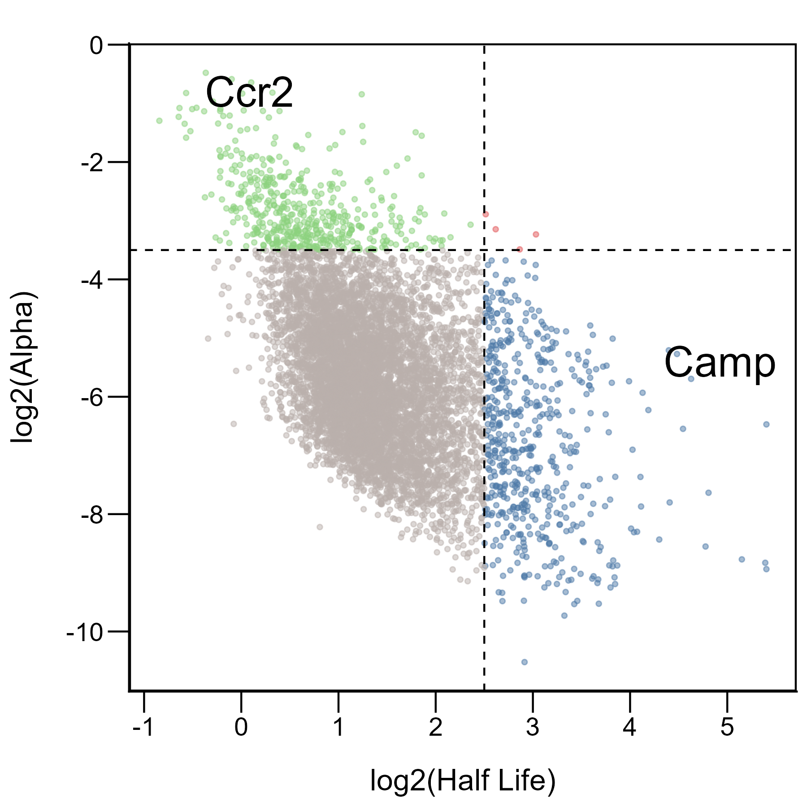
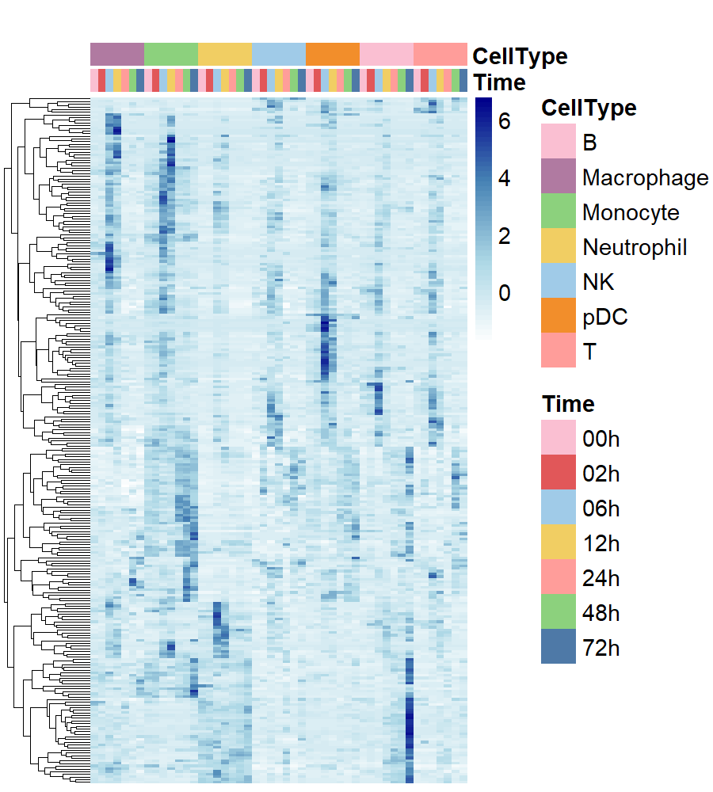
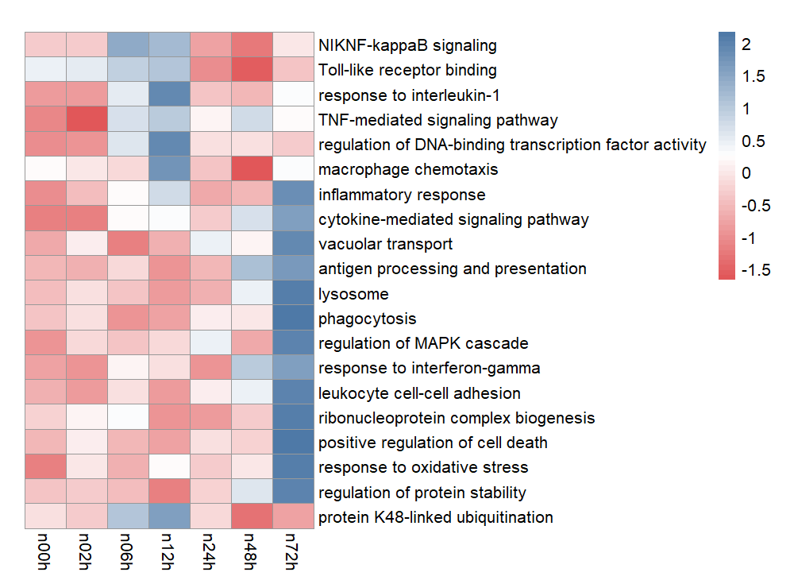
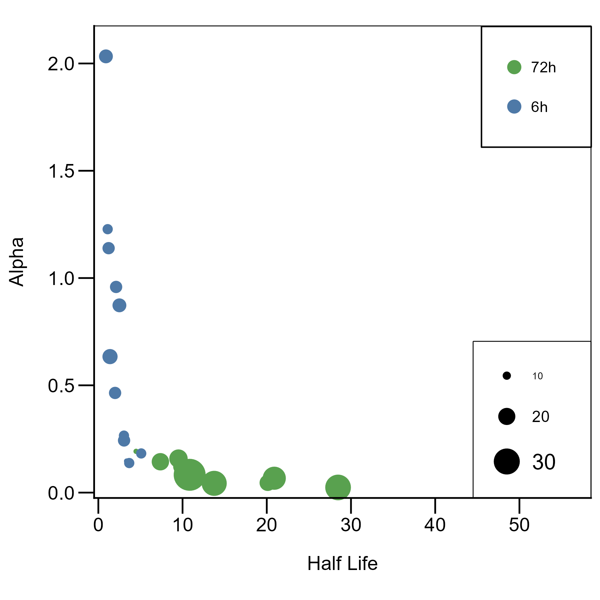
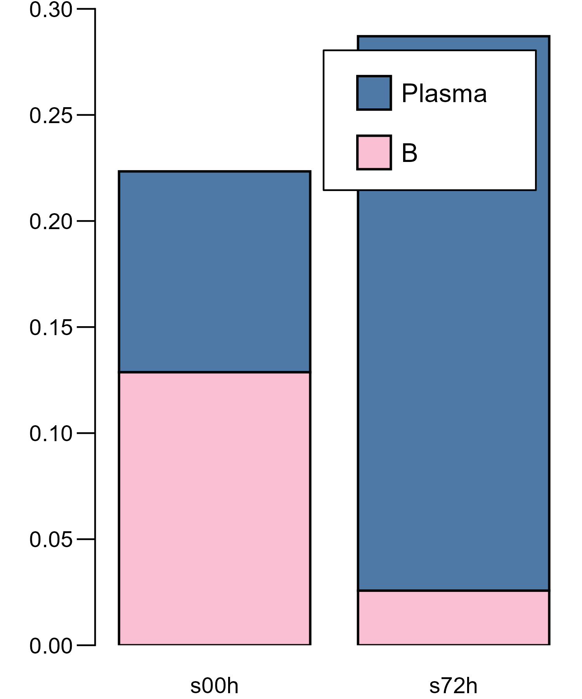
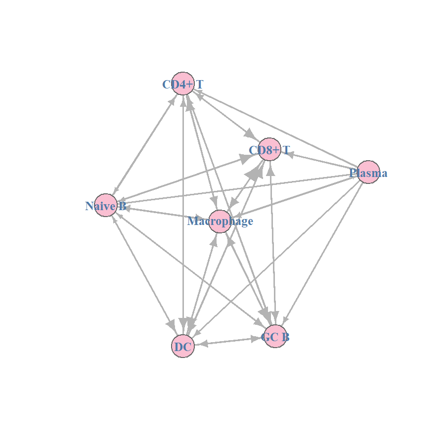

# Bioinformatics Visualization in R — Reproduction of a Seven-Panel Figure

Reproduction of seven visualization panels based on:

> Xiong, Z., Wu, R., Wang, Y. et al. *scIVNL-seq resolves in vivo single-cell RNA dynamics of immune cells during Salmonella infection.* Nat Commun 16, 7937 (2025). https://doi.org/10.1038/s41467-025-63155-1

Created as part of the HackBio Data Visualization in Bio (vizbio) Internship (Stage 2).

The study used scIVNL-seq, a single-cell RNA labelling sequencing method, to measure RNA synthesis and degradation in immune cells during acute enteric *Salmonella* infection, tracking RNA stability dynamics across multiple immune cell types over 72 hours.

---------------------------------------------------------------------------------------------

## Repository structure

```r
Part_2_Article_Reproduction/
├── README.md
├── dataset/
│   └── hb_stage_2.xlsx
├── scripts/
│   └── HackBio_HW_2_ArticleImage_FINAL.R
└── figures/
    ├── panel_2a_boxplot.png
    ├── panel_2b_scatterplot.png
    ├── panel_2c_boxplot.png
    ├── panel_2d_pathwayheatmap.png
    ├── panel_2e_bubble_plot.png
    ├── panel_2f_barchart.png
    ├── panel_2g_network.png
    └── final_figure_assembled_1.png
```

## Dataset

A single Excel workbook (`dataset/hb_stage_2.xlsx`, [original source](https://github.com/HackBio-Internship/2025_project_collection/raw/refs/heads/main/hb_stage_2.xlsx)) with one sheet per panel:

| Sheet | Content | Panel |
|-------|---------|-------|
| `a` | NTR (new-to-total RNA) ratios per single cell, with cell type | 2a |
| `b` | Half-life and alpha (degradation rate) per RNA transcript | 2b |
| `c` | Expression matrix: 257 genes × 49 conditions (7 cell types × 7 timepoints) | 2c |
| `d_1` | Enrichment scores: 20 pathways × 7 timepoints | 2d |
| `e` | Half-life, alpha and gene count per biological process at 6h and 72h | 2e |
| `f` | B cell and Plasma cell proportions at 4 timepoints | 2f |
| `g` | 7×7 adjacency matrix of cell–cell interaction strengths | 2g |

## How to run

```r
install.packages(c("readxl", "ggplot2", "pheatmap", "igraph",
                   "dplyr", "tidyr", "patchwork", "cowplot", "magick"))

library(readxl); library(ggplot2); library(pheatmap); library(igraph)
library(dplyr); library(tidyr)

excel_file <- "dataset/hb_stage_2.xlsx"
source("scripts/HackBio_HW_2_ArticleImage_FINAL.R")
```

Each task saves its panel as a PNG; the final section assembles all seven into one figure with `patchwork` and `cowplot`.

**Note on graphics systems:** `pheatmap` writes to a base R grid device, not a ggplot object, so panels 2c and 2d are saved with `png()` → `pheatmap()` → `dev.off()` and re-imported for assembly via `ggdraw() + draw_image()`. Assigning `pheatmap()` output to a variable and passing it to `patchwork` fails with *"non-numeric argument to binary operator"*.

------------------------------------------------------------------------------------------------------------

## Panel 2a — Boxplot: cell-type ratio distributions



### Dataset & Biology
- 6,796 immune cells from mouse bone marrow
- 10 cell types during *Salmonella* infection
- NTR (New to Total RNA) ratio = transcriptional activity
- Higher ratio → more active RNA synthesis

The `cell` column holds single-cell barcodes (e.g. `n00h_CAGATCTGCTCAATGATGGCTTCA`), where the prefix encodes the timepoint and the remainder uniquely identifies one cell. Each row is therefore one individual cell, not a transcript.

### Plot features
- Each cell type has a distinct colour from the HackBio palette
- Boxplot format displays median, quartiles, and data range
- Y-axis: 0–0.5 range, labelled "Ratio"
- Rotated x-axis labels (90°)
- Box width: 0.6
- Dashed whisker lines connecting boxes to T-shaped caps
- Data points beyond whiskers shown as small open circles

### Conceptual reasoning

**Why boxplots?**
- Show median, quartiles, and outliers in one compact visualization
- Enable direct comparison of distributions across 10 immune cell types
- Reveal outliers indicating cells with unusual RNA synthesis patterns
- Alternative plots (bar charts) would only show means, hiding distribution information

**What the plot shows on two levels**
- *Between cell types:* comparing medians shows which populations are most transcriptionally active
- *Within one cell type:* the spread of each box shows how much individual cells differ from each other, i.e. heterogeneity inside a defined population

**Biological insight**
- NTR ratio quantifies transcriptional activity: higher = active RNA synthesis, lower = quiescent or steady-state
- Different cell types show distinct activity levels reflecting their functional roles in the immune response

-------------------------------------------------------------------------------------------------------------------------------

## Panel 2b — Scatter plot: RNA kinetic regimes



### Dataset & Biology
- 7,326 RNA transcripts with RNA kinetic parameters
- Numerical values represent Alpha (degradation rate) and Half-life measurements
- Data from metabolic RNA labelling experiments
- Shows variability in RNA stability across the transcriptome during *Salmonella* infection

The column labelled `cell` in this sheet actually contains gene names (Ccr2, Camp, …) — a misleading header. What is measured is the stability of the RNA transcribed from those genes, not of the genes themselves.

### Plot features
- Each point represents one transcript (7,326 total)
- Four-quadrant colour scheme distinguishes RNA stability regimes (green, grey, blue, red)
- Dashed cutoff lines divide the plot at half-life = 2.5 (vertical) and alpha = −3.5 (horizontal)
- Two genes labelled for reference: Ccr2 and Camp
- Axes show log2-transformed values
- Semi-transparent points show darker areas where transcripts cluster densely
- Black panel border frames the plot area

### Conceptual reasoning

**Why log2 transformation?**
- Creates symmetric representation: a 2-fold increase and a 2-fold decrease are equidistant from zero
- Compresses the wide range of half-life and alpha values into an interpretable scale
- Normalizes exponential decay kinetics into linear relationships
- Standard approach for RNA kinetics analysis

**Why quadrant division?**
- Manually chosen cutoffs (half-life = 2.5, alpha = −3.5) separate transcripts into four kinetic regimes
- Each quadrant represents a distinct **RNA regulatory strategy**, i.e. post-transcriptional control through stability and degradation
- Half-life and alpha are inversely related: long half-life + low alpha = stable; short half-life + high alpha = unstable
  - Upper-left (green): short half-life, high alpha — rapid turnover
  - Lower-left (grey): short half-life, low alpha
  - Lower-right (blue): long half-life, low alpha — persistent transcripts
  - Upper-right (red): long half-life, high alpha
- Manual thresholds were used rather than data-driven ones so that the cutoffs remain biologically meaningful and reproducible across datasets

**Biological insight**
- Labelled examples contrast two regimes: Ccr2 (rapid turnover) vs Camp (persistent)
- Different kinetic regimes likely reflect different functional roles: rapid-response genes vs sustained-expression genes

------------------------------------------------------------------------------------------------------------

## Panel 2c — Complex heatmap: temporal gene expression



*(The filename carries `boxplot` from the script structure; the panel is a heatmap.)*

### Dataset & Biology
- 257 differentially expressed genes
- 49 columns: 7 timepoints (0h, 2h, 6h, 12h, 24h, 48h, 72h post-infection) for 7 immune cell types
- Numerical values show gene expression levels across studied conditions (cell type & timepoint)
- Data shows temporal gene expression response during *Salmonella* infection

Column naming format: `[CellType]n[Time]`, e.g. `Macrophagen00h`. Cell type and timepoint are parsed from the column names with `gsub()` to build the annotation table.

### Plot features
- Colour gradient (white → light blue → steel blue → dark blue) indicates expression levels
- Hierarchical clustering dendrogram (left) groups genes with similar expression patterns
- Columns preserve their original order (no clustering)
- Dual annotation bars identify cell type (top) and timepoint (second row) with colour coding
- Gene names hidden due to high count (257 total)
- Expression scale legend shows the normalized count range
- Custom colour palettes distinguish 7 cell types and 7 timepoints in the legends

### Conceptual reasoning

**Why cluster rows but not columns?**
- Genes (rows) are clustered to group similar patterns — genes that activate or suppress together likely share regulatory mechanisms
- Columns keep their original order so that cell types stay grouped and the time sequence (0h → 72h) is preserved within each cell type
- Clustering columns would reorder them by similarity instead of by time, mixing the timeline up and making temporal patterns impossible to see

**Why hide row and column names?**
- 257 gene labels cannot be rendered legibly at this figure size
- Column identity is carried by the two annotation bars instead of by text labels

**Biological insight**
- Clustered gene groups represent coordinated transcriptional programs
- Some genes respond early, others late; cell-type-specific blocks are visible across the timeline

---------------------------------------------------------------------------------------------------------

## Panel 2d — Pathway enrichment heatmap



### Dataset & Biology
- 20 biological pathways (rows)
- 7 timepoints (0h, 2h, 6h, 12h, 24h, 48h, 72h) (columns)
- Numerical values represent enrichment scores for each pathway at every condition
- Positive values for upregulation, negative values for downregulation
- Shows temporal progression of immune pathway activation during *Salmonella* infection response

### Plot features
- Diverging colour palette (red → white → blue) distinguishes pathway regulation: red for downregulation, blue for upregulation, white for no change
- No clustering applied — rows and columns preserve pathway grouping and temporal order
- All 20 pathway names displayed for clear identification
- All 7 timepoint labels shown, marking infection progression
- Grey cell borders (grey60) create a visible grid structure
- Fixed cell dimensions (25 × 15) keep pathway–timepoint intersections readable

### Conceptual reasoning

**Why no clustering at all?**
- *Columns:* the timepoint sequence must remain intact to show how pathways respond across infection — activation, peak, and resolution phases
- *Rows:* the original pathway order keeps related biological processes together; clustering would regroup them by temporal pattern and obscure those functional relationships

**Why a diverging colour palette?**
- Enrichment scores are signed values, and zero is biologically meaningful: it represents no change from the baseline/uninfected state
- Red–white–blue centres the scale on that zero: red = suppression, white = no change, blue = activation
- Colour intensity carries magnitude; a single-gradient palette would lose the direction of regulation entirely

**Biological insight**
- 20 pathways show diverse temporal dynamics during infection
- Some activate early (immediate defence), others late (ongoing response)
- Shared colour patterns across rows point to co-regulated pathway groups

---------------------------------------------------------------------------------------------------------------------

## Panel 2e — Bubble plot: process-level RNA kinetics



### Dataset & Biology
- 22 biological processes (rows)
- RNA kinetic parameters: Half-life and Alpha (degradation rate)
- Two timepoints: 6h and 72h post-infection
- Gene count indicates number of genes per process
- Data shows early and late RNA kinetic patterns during *Salmonella* infection

### Plot features
- Each bubble represents one biological process (22 total)
- Bubble size encodes gene count: larger bubbles indicate more genes involved in that process
- Colour legend distinguishes timepoints (6h early response: blue; 72h late response: green)
- Custom size legend displays three reference values (10, 20, 30 genes) with corresponding bubble sizes
- Dual legend system: timepoint colours (upper right), gene count scale (lower right); both have borders
- Axes scaled to show Half-life (0–50) and Alpha (0–2.0) ranges
- Black panel border frames the plot area

### Conceptual reasoning

**Why encode gene count as bubble size?**
- Larger bubbles = more genes involved in that biological process
- Reflects process scope: major immune pathways recruit many genes
- Visual weight corresponds to biological weight, so the eye is drawn to the largest processes
- Allows kinetics (position) and scope (size) to be read simultaneously

**Why compare 6h vs 72h?**
- Captures two distinct infection phases: 6h (immediate/acute response) and 72h (ongoing response)
- Enough separation in time to observe major shifts in kinetic patterns
- Intermediate timepoints were excluded for visual clarity — the comparison is between endpoints
- Size and colour together encode temporal change: each bubble shows how many genes are involved at which infection stage, so early response (6h, small blue bubbles) involves fewer genes per process, while late response (72h, large green bubbles) recruits larger gene sets

**Implementation note**
- ggplot2 does not generate this style of size legend automatically. It was built manually: `annotate("point")` and `annotate("text")` for each reference bubble, plus four `annotate("segment")` calls for the border box, positioned outside the panel using `coord_cartesian(clip = "off")`.

-------------------------------------------------------------------------------------

## Panel 2f — Stacked bar chart: B to Plasma cell proportions



### Dataset & Biology
- B cell and Plasma cell proportion measurements
- Data from 4 timepoints (0h, 2h, 6h, 72h); plot shows 0h vs 72h
- Numerical values represent B/Plasma cell proportions at each timepoint
- Changing proportions reflect B cell differentiation during infection

### Plot features
- Two bars compare timepoints: s00h (baseline) and s72h (late infection)
- Reverse stacking: Plasma cells (blue) on top, B cells (pink) below
- Black borders (linewidth 0.7) outline each cell type segment
- Y-axis: 0–0.30 scale with 0.05 increments, no gap at the bottom, extended tick marks (0.4 cm)
- X-axis labels positioned below bars with no axis line or ticks
- Legend positioned inside the plot with a black border
- Legend order matches the visual stack: Plasma listed above B
- Bar width 0.8

### Conceptual reasoning

**Why stacked bars instead of side-by-side?**
- B cells + Plasma cells together make up the B-lineage population, so the segments within each bar sum to the whole
- Side-by-side bars would obscure this complementary relationship: as one proportion falls the other rises
- Total bar height carries additional information about the combined population at each timepoint

**Why reverse the stacking order?**
- Follows the logic of cell maturation: B cells are precursors (base), Plasma cells are the mature differentiated product (on top)
- `position_stack(reverse = TRUE)` reverses the bars, and `guides(fill = guide_legend(reverse = TRUE))` is needed as well so the legend order matches the stack — without it the stack says one thing and the legend another

**Why 0h vs 72h?**
- The dataset contains 4 timepoints, but the plot compares the two endpoints for a clear before/after reading
- s00h represents the baseline state, s72h the state after differentiation

**Biological insight**
- Differentiation of B cells into antibody-secreting Plasma cells is a hallmark of adaptive immunity, and the proportion shift makes this visible

-----------------------------------------------------------------------------------------------------

## Panel 2g — Directed cell–cell interaction network



### Dataset & Biology
- 7×7 adjacency matrix: cell–cell interaction data for 7 cell types
- Numerical values represent interaction strength between cell types
- Asymmetric values indicate directional signalling (e.g. CD4+T→CD8+T = 0.585 ≠ CD8+T→CD4+T = 0.386)
- Data from the *Salmonella* infection immune response study

An adjacency matrix is a network data format in which rows and columns are both nodes and each value is the strength of the connection between them. Asymmetry is checked by comparing opposite positions: entry [i, j] against entry [j, i].

### Plot features
- Seven nodes represent immune cell types (CD4+ T, CD8+ T, Naive B, GC B, Plasma, Macrophage, DC)
- Uniform node styling: pink fill, size 18, grey borders, blue serif labels centred on nodes
- Uniform edge styling: grey colour, width 2, straight lines
- Arrow size varies proportionally to interaction strength
- Zero-weight edges removed, so edge presence indicates a non-zero interaction
- Connections appear bidirectional (arrows at both ends) because the two opposite directed edges overlap along the same straight line

### Conceptual reasoning

**Why directed?**
- Cell–cell signalling is inherently directional: one cell sends a signal, another receives it. A T cell activating a B cell is a different biological event from a B cell presenting antigen to a T cell
- The matrix structure is interpreted as a directed network following the igraph convention, where entry [i, j] is an edge from row *i* to column *j* — rows as sender, columns as receiver. This is a software convention applied by `graph_from_adjacency_matrix(mode = "directed")`, not something stated in the source file
- The asymmetry of the matrix justifies that choice: if interactions were mutual, the matrix would be symmetric

**What does edge weight encode biologically?**
- Interaction strength or communication frequency between a pair of cell types
- It may reflect cytokine secretion levels, the number of ligand–receptor pairs expressed, or combined signalling activity
- Higher weight = more intense or more frequent signalling; weight differences show which cell pairs communicate most actively during infection
- In this figure weight is encoded through arrow size (`E(g)$arrow.size <- E(g)$weight * 2`) while line width is held constant, keeping the graph readable. The scaling factor matters: too small and differences vanish, too large and the arrows dominate the figure

**Layout**
- Node positions were set manually rather than by an algorithm. Force-directed placement (`layout_with_fr`) was tested, but on a graph this dense — 7 nodes with most pairs connected in both directions — it produced heavy edge overlap. Manual coordinates gave the control needed to match the reference figure and keep the connection pattern readable

**Biological insight**
- The network shows the immune response as a coordinated system rather than isolated cell types, with some populations acting as highly connected hubs

-----------------------------------------------------------------------------------------------------------------------

## Tools

| Package | Use |
|---------|-----|
| `readxl` | Reading the multi-sheet Excel dataset |
| `dplyr`, `tidyr` | Data reshaping, filtering, quadrant assignment |
| `ggplot2` | Panels 2b, 2e, 2f |
| `pheatmap` | Panels 2c, 2d |
| `igraph` | Panel 2g |
| base R graphics | Panel 2a |
| `patchwork`, `cowplot`, `magick` | Final multi-panel assembly |

-----------------------------------------------------------------------------------------------------------------------------------

*All visualizations were created as part of the HackBio Data Visualization in Bio (vizbio) Internship.*


